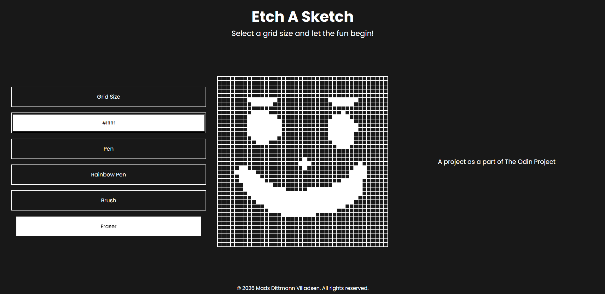

# the-odin-project

A collection of projects completed as part of The Odin Project curriculum, focused primarily on HTML, CSS, and JavaScript. To get the most out of the learning process, I've made a personal rule to avoid AI assistance - everything here is written by me, with help only from traditional resources like MDN and Stack Overflow.

## Projects

### Etch A Sketch

Etch-A-Sketch is a simple web application for drawing on a grid in the browser by clicking and dragging the mouse across the cells - built as [an exercise](https://www.theodinproject.com/lessons/foundations-etch-a-sketch) in vanilla JavaScript, DOM manipulation, and event handling.

