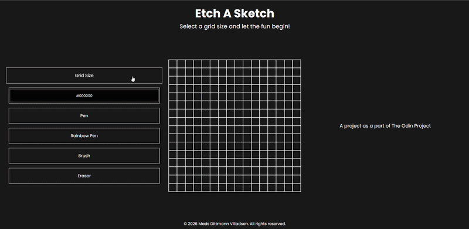
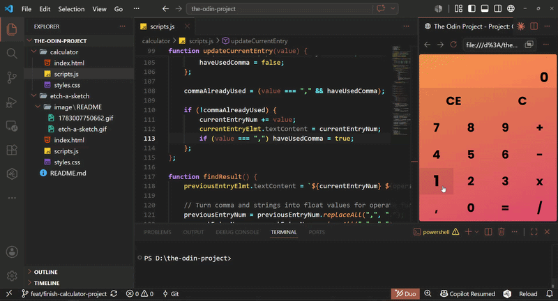

# Foundations

A collection of projects completed as part of The Odin Project curriculum for the Foundations course, focused primarily on HTML, CSS, and JavaScript. To get the most out of the learning process, I've made a personal rule to avoid AI assistance - everything here is written by me, with help only from traditional resources like MDN and Stack Overflow.

## Projects

### Etch A Sketch

Etch-A-Sketch is a simple web application for drawing on a grid in the browser by clicking and dragging the mouse across the cells - built as [an exercise](https://www.theodinproject.com/lessons/foundations-etch-a-sketch) in vanilla JavaScript, DOM manipulation, and event handling.

### Calculator

The Calculator Project is a simple web application for calculating simple mathematical operations in the browser by using the GUI. built as [an exercise](https://www.theodinproject.com/lessons/foundations-calculator) in vanilla JavaScript, DOM manipulation, and event handling.

© 2026 Mads Dittmann Villadsen. All Rights Reserved.
