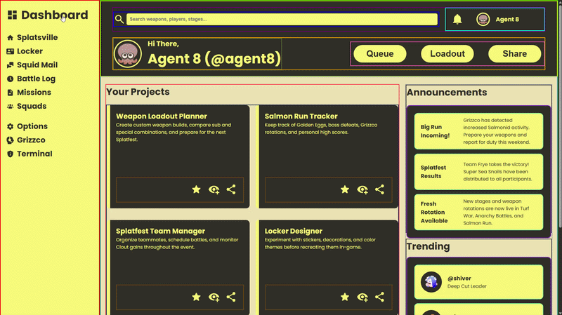
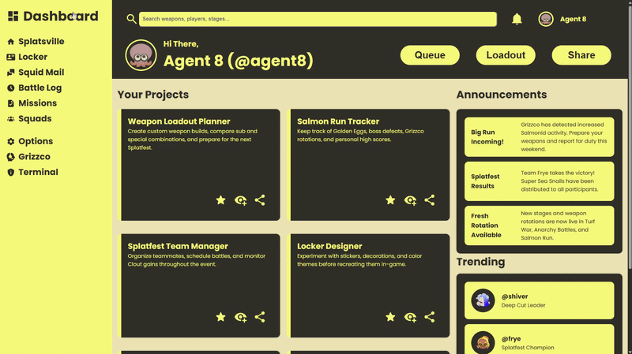

# Project: Sign-up Form

A Splatoon-themed Admin Dashboard built entirely with HTML and nested CSS grid layouts, exploring responsive multi-level grid structures across a sidebar, header, and dynamic content areas.

[Link to project details](https://www.theodinproject.com/lessons/node-path-intermediate-html-and-css-admin-dashboard)

## Solved solution

### With grid border outlines

### Without grid border outlines

#FRYESUPREMACY