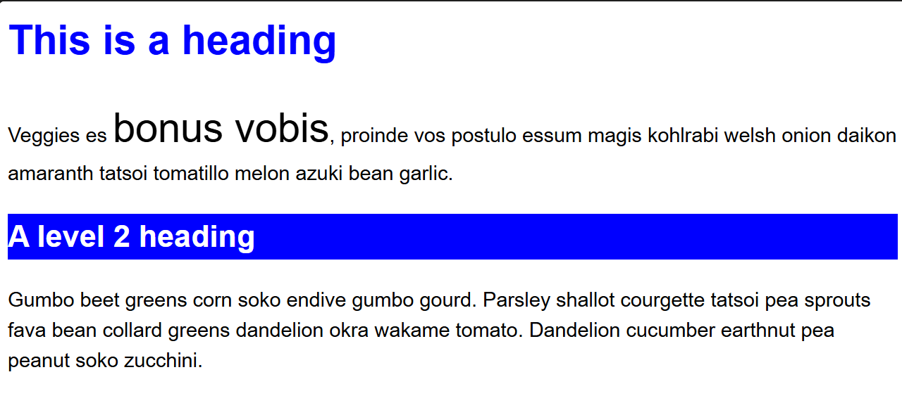
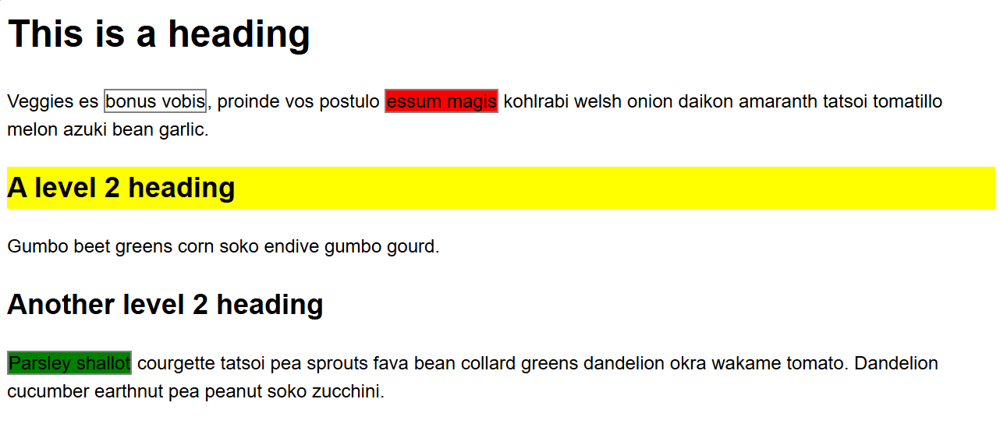
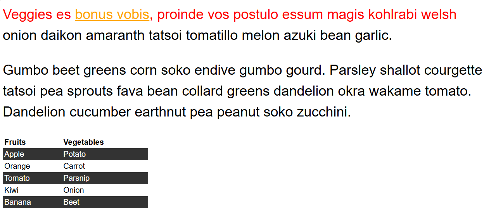
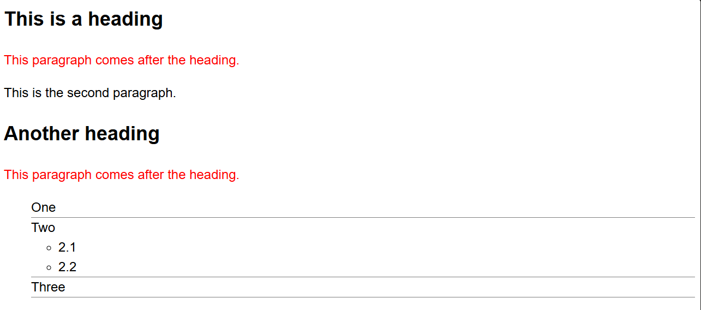
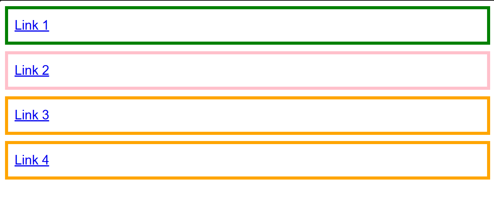

# Exercise

[Link to exercise](https://developer.mozilla.org/en-US/docs/Learn_web_development/Core/Styling_basics/Test_your_skills/Selectors)

## Solved solution

### [Selectors 1](https://developer.mozilla.org/en-US/docs/Learn_web_development/Core/Styling_basics/Test_your_skills/Selectors#selectors_1)

### [Selectors 2](https://developer.mozilla.org/en-US/docs/Learn_web_development/Core/Styling_basics/Test_your_skills/Selectors#selectors_2)

### [Selectors 3](https://developer.mozilla.org/en-US/docs/Learn_web_development/Core/Styling_basics/Test_your_skills/Selectors#selectors_3)

### [Selectors 4](https://developer.mozilla.org/en-US/docs/Learn_web_development/Core/Styling_basics/Test_your_skills/Selectors#selectors_4)

### [Selectors 5](https://developer.mozilla.org/en-US/docs/Learn_web_development/Core/Styling_basics/Test_your_skills/Selectors#selectors_5)

