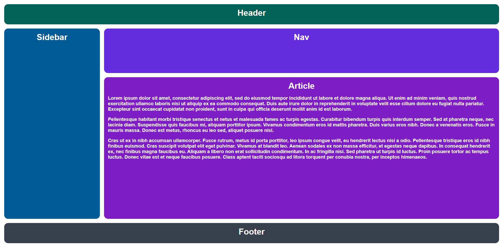

# Exercise

[Link to exercise](https://github.com/TheOdinProject/css-exercises/tree/main/intermediate-html-css/positioning-grid/01-basic-holy-grail)

## Solved solution

### Desired outcome

### Solution*

**Solution is using grid-template + grid-area.*
