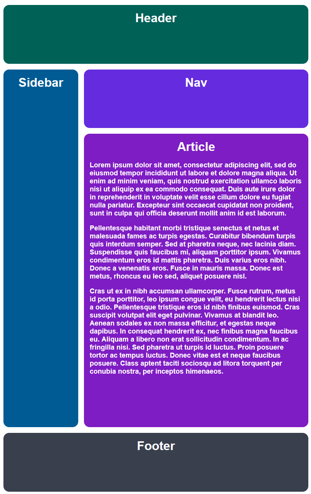
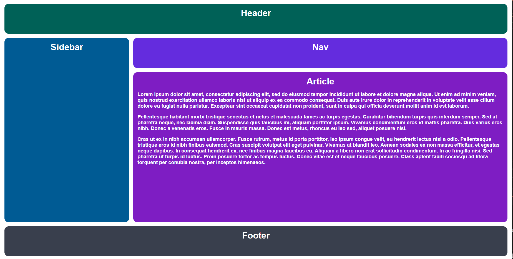
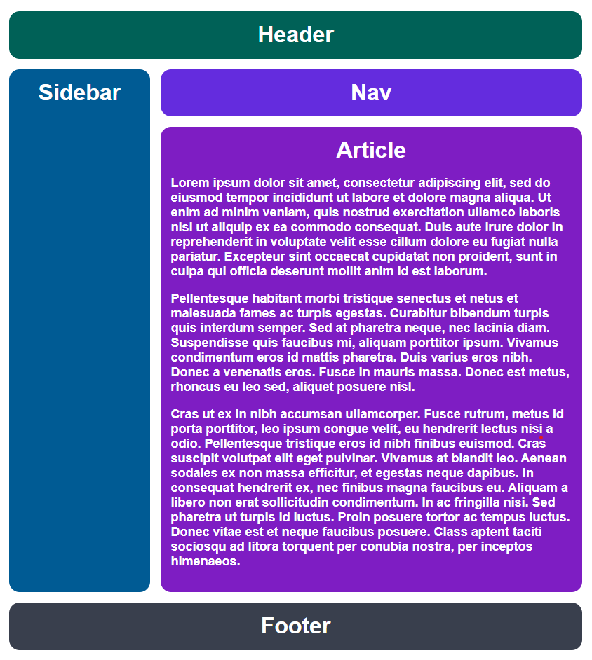

# Exercise

[Link to exercise](https://github.com/TheOdinProject/css-exercises/tree/main/intermediate-html-css/advanced-grid/01-responsive-holy-grail)

## Solved solution

### Desired outcome

#### Regular

#### Narrow

### Solution*

#### Regular

#### Narrow

**Solution is using shorthand grid-template.*
