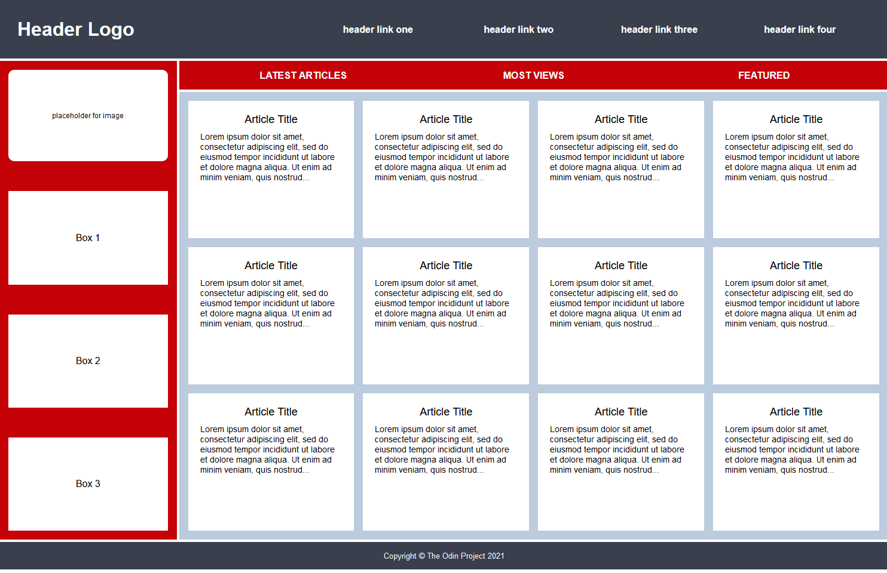
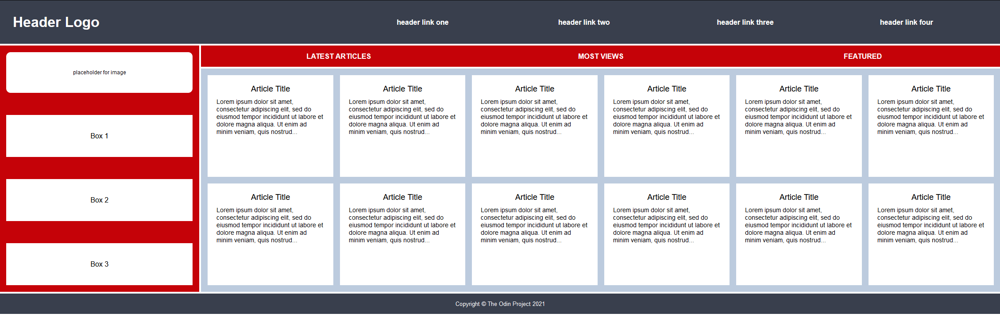
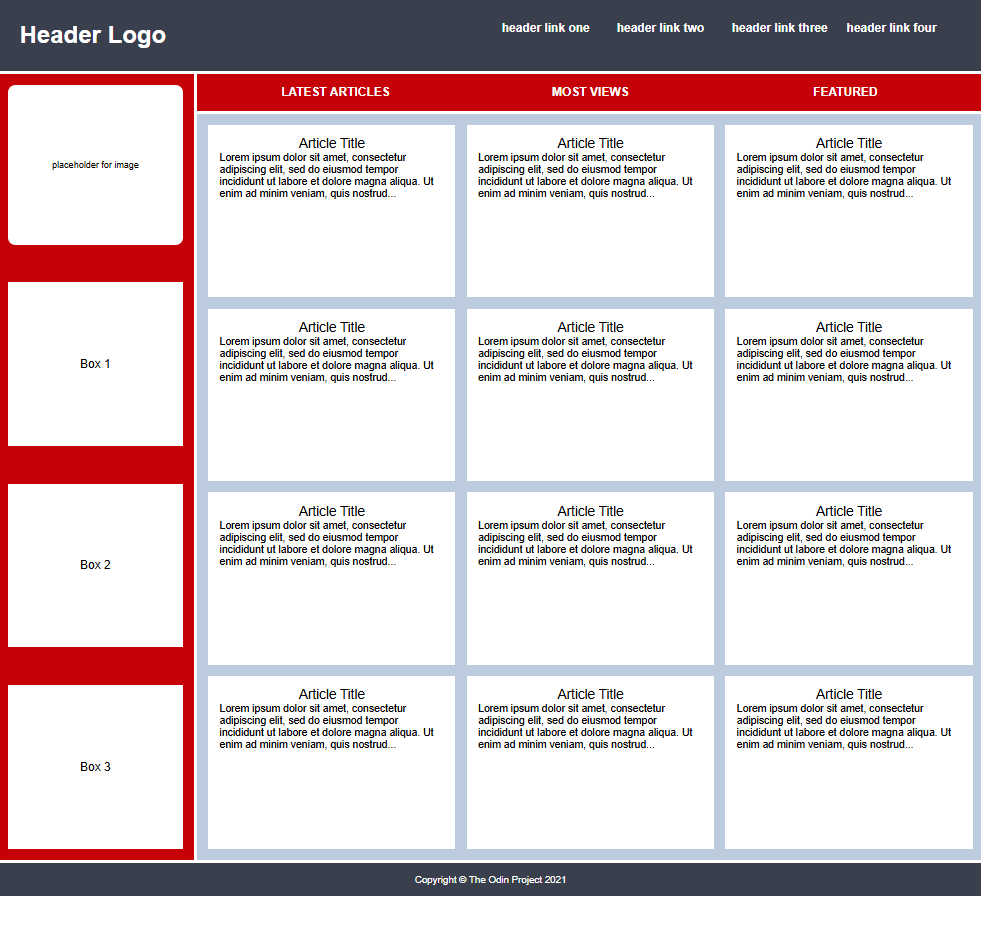
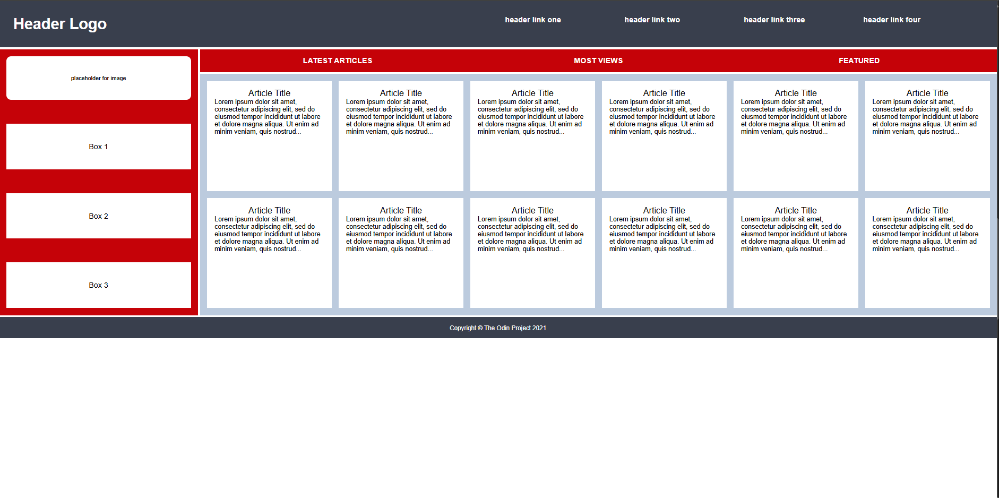

# Exercise

[Link to exercise](https://github.com/TheOdinProject/css-exercises/tree/main/intermediate-html-css/advanced-grid/02-holy-grail-mockup)

## Solved solution

### Desired outcome

#### Regular

#### Stretched

### Solution*

#### Regular

#### Stretched

**Solution is using shorthand grid-template and grid-area.*
