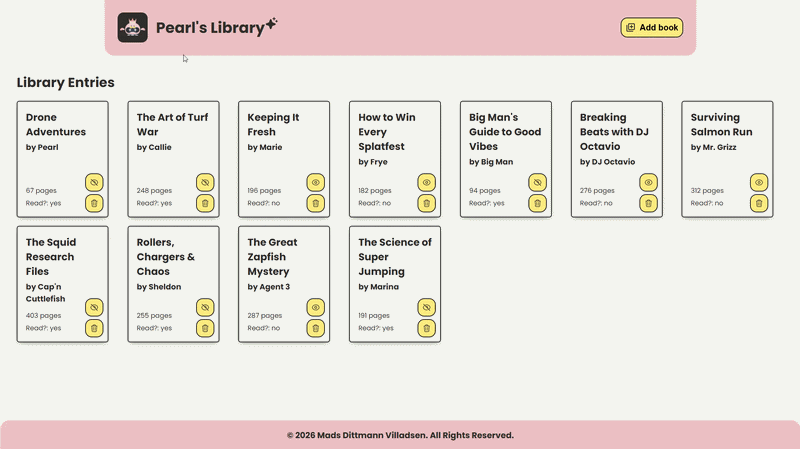

# Project: Library

A Splatoon-themed library for Pearl, built with HTML, CSS, and JavaScript. This project explores object constructors, prototypes, DOM manipulation, dynamic rendering, form validation, and the native `<dialog>` element for a polished user experience.

[Link to project details](https://www.theodinproject.com/lessons/node-path-javascript-library)

## Solved solution

***Exploring `<dialog>` was only an optional part of the assignment, but I took the opportunity to experiment with it and further improve my skills.***