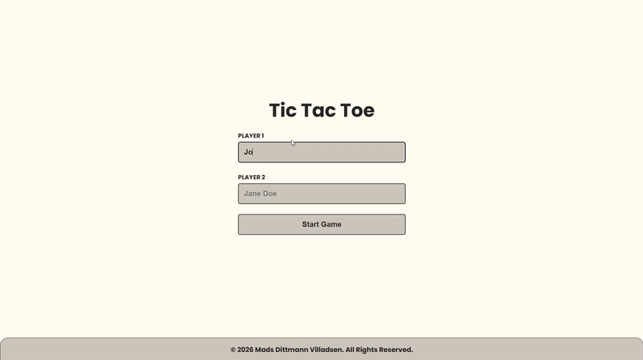

# Project: Tic Tac Toe

A Tic Tac Toe game built with HTML, CSS, and JavaScript. This project explores factory functions, the module pattern (IIFE), closures, and organizing code so that game logic, board state, and DOM rendering each stay cleanly separated and don't leak into one another.

[Link to project details](https://www.theodinproject.com/lessons/node-path-javascript-tic-tac-toe)

## Solved solution

***Special care was taken to keep global scope minimal - `Gameboard`, `Game`, and `displayController` are the only three names exposed globally, with everything else tucked inside their respective modules.***