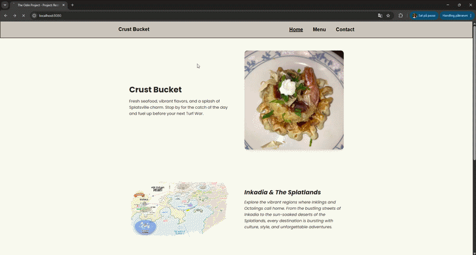

# Project: Restaurant Page

A Splatoon-themed restaurant page for the fictional restaurant "Crust Bucket", built with HTML, CSS, and JavaScript. This project explores webpack bundling, ES6 modules, dynamically generating page content with JavaScript, and organizing code by separating each page into its own module.

[Link to project details](https://www.theodinproject.com/lessons/node-path-javascript-restaurant-page)

## Solved solution

***The entire page is generated dynamically through JavaScript modules, with separate files handling the home, menu, and contact sections. Webpack is used to bundle assets, including images and styles, while keeping the project structure organized and maintainable.***