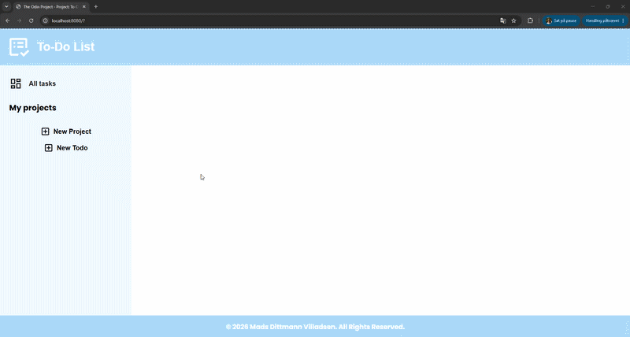

# Project: Todo List

A to-do list application built with HTML, CSS, and JavaScript. Todos are organized into projects, with full support for creating, editing, completing, and deleting both projects and todos. This project explores webpack bundling, ES6 modules/classes, separating application logic from DOM rendering, and persisting data with the Web Storage API.

[Link to project details](https://www.theodinproject.com/lessons/node-path-javascript-todo-list)

## Solved solution

***Projects and todos are modeled as ES6 classes (`project`, `todo`) with all data logic (adding, editing, completing, deleting) kept fully separate from the DOM. A `storage` module manages the in-memory list of projects and automatically persists every change to `localStorage`, rebuilding proper class instances on load so restored data keeps all of its methods. A `layout` module handles all rendering, split into focused functions (sidebar, todo grid, dialogs) rather than one large render function, and uses native `<dialog>` elements for the "create project" and "create todo" forms.***