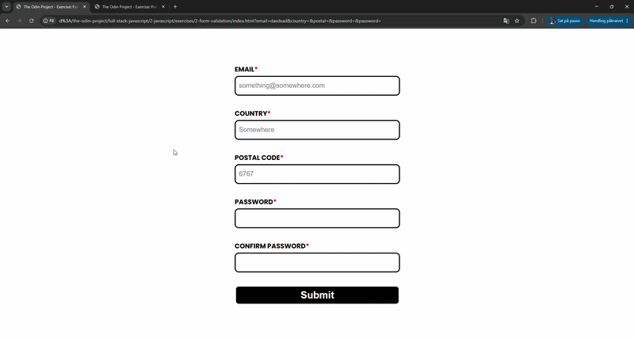

# Exercise

[Link to exercise](https://www.theodinproject.com/lessons/node-path-javascript-form-validation-with-javascript)* 

**Scroll down to "Assignment", and then "A little more practice".*

## Solved solution*

**Solution uses the Constraint Validation API with custom JavaScript, since the form has `novalidate` set. Each field (Email, Country, Postal Code, Password, Confirm Password) is validated live as the user types, with inline error messages and red/green border feedback via `:user-invalid`/`:user-valid`. Submitting shows a red "INVALID FIELDS..." or green "HIGH FIVE! :D" message depending on whether all fields pass.*